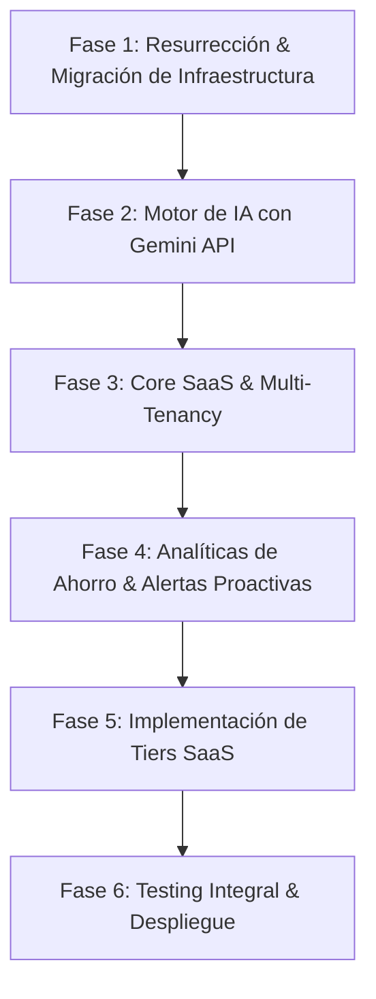

# FoodSense SaaS — Hoja de Ruta del Proyecto (ROADMAP.MD)

**Objetivo:** Revivir FoodSense, migrar la base de datos a una instancia bajo control directo, reemplazar el backend de IA antiguo por la API de Google Gemini y evolucionar la plataforma a un SaaS web mobile-first completo para la entrega académica.

---

## 🗺️ Fases de Ejecución

---

## Fase 1: Resurrección & Migración de Infraestructura (Base de Datos & Auth)
**Objetivo:** Dejar operativo el proyecto web localmente conectado a una base de datos propia de Supabase.

- [ ] **1.1 Creación de Proyecto Supabase Propio:**
  - Crear nuevo proyecto en `supabase.com` en región São Paulo (menor latencia).
  - Configurar las variables en `.env.local` (`NEXT_PUBLIC_SUPABASE_URL`, `NEXT_PUBLIC_SUPABASE_ANON_KEY`).
- [ ] **1.2 Ejecución de Migraciones SQL:**
  - Ejecutar el script DDL de `SPECS.md` en el SQL Editor de Supabase (`products`, `product_events`, `households`, `household_members`).
  - Habilitar Row Level Security (RLS) y verificar políticas de acceso por usuario (`auth.uid() = user_id`).
- [ ] **1.3 Integración de Firebase Auth con Supabase (Arquitectura Híbrida):**
  - Mantener Firebase Auth para el Login con Google y Email.
  - Configurar Firebase como proveedor "Third-Party Auth" en Supabase.
  - Validar que `supabase-client.ts` inyecte el JWT de Firebase correctamente para que RLS funcione.
- [ ] **1.4 Validación de Inventario Básico:**
  - Probar creación, lectura, actualización y eliminación de productos (`/despensa`, `/agregar`, `/editar`).

---

## Fase 2: Modernización del Motor de IA con Google Gemini
**Objetivo:** Reemplazar el antiguo endpoint de AWS Lambda + OpenAI por una ruta interna optimizada con Gemini API.

- [ ] **2.1 Configuración de Google Gen AI SDK:**
  - Instalar dependencias `@google/genai` o `@google/generative-ai`.
  - Configurar `GEMINI_API_KEY` en `.env.local`.
- [ ] **2.2 Implementación del Route Handler `/api/voice/actions`:**
  - Crear `web/src/app/api/voice/actions/route.ts` con Next.js App Router.
  - Recibir audio base64 (`audio/webm`, `audio/mp4`, `audio/wav`).
  - Enviar audio directamente al modelo `gemini-2.0-flash` o `gemini-1.5-flash` con `responseSchema` JSON estricto.
- [ ] **2.3 Conexión con la UI de Voz:**
  - Actualizar `src/components/voz/voice-button.tsx` para llamar a `/api/voice/actions`.
  - Probar el flujo completo: Grabar audio -> Procesamiento Gemini -> Modal `VoiceActionModal` con acciones sugeridas -> Confirmación e inserción en base de datos.

---

## Fase 3: Core SaaS & Experiencia Mobile-First
**Objetivo:** Consolidar las funciones de valor de la despensa inteligente y capacidades colaborativas.

- [ ] **3.1 Ordenamiento y Filtros por Urgencia (US-07 y US-08):**
  - Consolidar algoritmo de semáforo de urgencia (Rojo ≤1 día, Ámbar ≤4 días, Verde >4 días).
  - Filtro por categorías con contadores reactivos.
  - Búsqueda en tiempo real por nombre de producto.
- [ ] **3.2 Acciones de Consumo y Descarte (US-09 y US-10):**
  - Registro de eventos en `product_events` al marcar como consumido (`consumed`) o eliminar (`wasted`).
  - Modal de confirmación y feedback visual accesible.
- [ ] **3.3 Escáner de Código de Barras e Inferencia:**
  - Validación del lector de cámara con `@zxing/browser` (`/agregar`).
  - Autocompletado inteligente de nombre y categoría sugerida.
- [ ] **3.4 Colaboración Familiar / Multi-Tenancy (Opcional SaaS):**
  - Soporte para asociar productos al `household_id` del usuario.

---

## Fase 4: Analíticas de Ahorro & Alertas Proactivas
**Objetivo:** Proveer a los usuarios métricas visuales del valor del SaaS (ahorro y reducción de desperdicio).

- [ ] **4.1 Dashboard de Impacto en Home (`/`):**
  - Indicadores clave: Productos activos, por vencer, consumidos vs desperdiciados en el mes.
  - Estimación de dinero ahorrado y tasa de aprovechamiento (%).
- [ ] **4.2 Centro de Alertas (`/alertas`):**
  - Lista clasificada de vencimientos críticos y próximos.
  - Configuración de recordatorios y soporte de notificaciones push vía Service Worker.

---

## Fase 5: Implementación de Tiers SaaS & Monetización
**Objetivo:** Introducir el modelo de negocio para el Trabajo Práctico diferenciando usuarios Free y Premium.

- [ ] **5.1 Definición y Control de Tiers (Free vs Premium):**
  - Implementar lógica de validación de tier del usuario en la base de datos o en la sesión de Firebase.
- [ ] **5.2 Limitación de Funciones IA:**
  - Bloquear el acceso a `/api/voice/actions` y al botón de voz en el frontend si el usuario es Free (mostrar "Upgrade to Premium").
- [ ] **5.3 Pasarela de Pago Mock / Simulación:**
  - Crear una pantalla `/premium` o modal para simular la suscripción al Tier Familiar/Pro.

---

## Fase 6: Testing Integral, Calidad & Entrega
**Objetivo:** Asegurar la robustez de la aplicación mediante el Plan de Pruebas.

- [ ] **5.1 Ejecución de Pruebas Unitarias y de Integración:**
  - Cálculos de fechas de vencimiento y reglas de frescura (`date-utils.test.ts`, `urgency.test.ts`).
  - Validación de esquemas de respuesta de Gemini API.
- [ ] **5.2 Pruebas E2E y de Usabilidad Mobile:**
  - Flujo de Registro -> Carga por Voz con Gemini -> Ver en Despensa -> Consumir.
  - Verificación en viewports móviles (375px - 430px) y desktop (>1024px).
- [ ] **5.3 Build de Producción y Verificación de Lints:**
  - `pnpm build` y `pnpm lint` sin advertencias.
  - Despliegue en Vercel (o plataforma compatible) listo para demo del TP.
